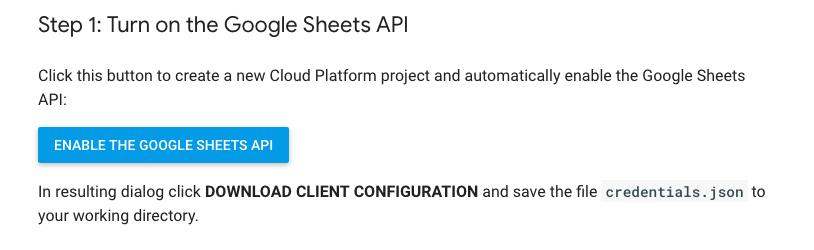
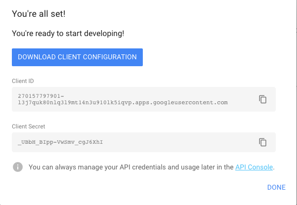
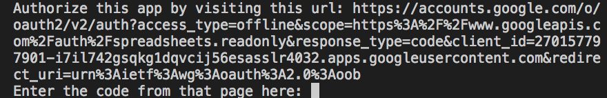

<br>

# Kustomer - Import Data Problem

Task: Import customer information from a google spreadsheet into Kustomer using Kustomers APIs.


## Getting Started

These instructions will get you a copy of the project up and running on your local machine for development and testing purposes.

### Thing we'll need

- Node.js installed(also installs npm)
- credentials.json file

You can download Node.js by following this link and follow their instructions on the site

```
https://nodejs.org/en/
```

Once Node.js is installed you can verify by entering this in your terminal

```
node --version && npm --version
```

I've included a credentials.json which created a new Cloud Platform project and automatically enable the Google Sheets API:

If you would like to use your own credentials visit:
```
https://developers.google.com/sheets/api/quickstart/nodejs
```



Once you click enable, a pop-up will appear where you can then copy or download your credentials



If you downloaded your own credentials.json file, you will need to include it in the project folder.

### Installing dependencies

Dependecies
- Request
- GoogleAPI

To install dependencies, type the following command in your terminal<br/>
*note: make sure you're in the correct directory*

```
npm install 
```

### How to run

Once you've got your credentials and packages installed you're ready to migrate some files!

To start the application, enter this in your terminal

```
node index.js
```
The first time you run the application, it will prompt you to authorize access:



1. Browse to the provided URL in your web browser.

2. If you are not already logged into your Google account, you will be prompted to log in. If you are logged into multiple Google accounts, you will be asked to select one account to use for the authorization.

3. Click the Accept button.

4. Copy the code you're given, paste it into the command-line prompt, and press Enter.

Once you press enter, the application will automatically pull data from the GoogleSheet and make POST requests to 
```
https://api.kustomerapp.com/v1/customers
```


## Built With

* [Request](https://www.npmjs.com/package/request) - Simplified HTTP client
* [GoogleAPI](https://developers.google.com/sheets/api/quickstart/nodejs) - GoogleSheets API

## Thank you

Thank you for the opportunity to take this code challenge!
